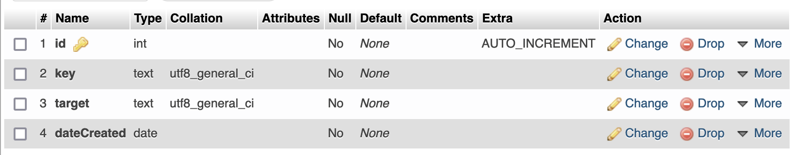
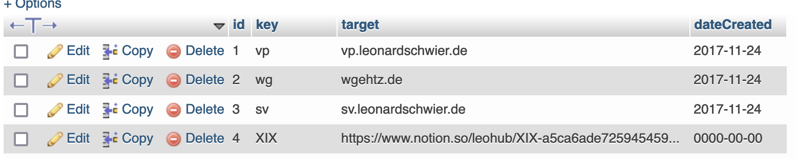

# url-shortener
An easy URL shortener

## Requirements
- MySQL database
- PHP webserver

## Instructions
1. Set up database structure and configure database access in `db_connect.php`
2. Add row to database (e.g., through PHPMyAdmin) with at least values for `key` and `target`
3. Call URL to use URL shortener

### Database structure

## Example
- Add the "key" `ggl` and the "target" `google.com` as rows to the database
- Open in your webbrowser `yourdirectory.com/url-shortener/ggl` to be redirected to `google.com`

